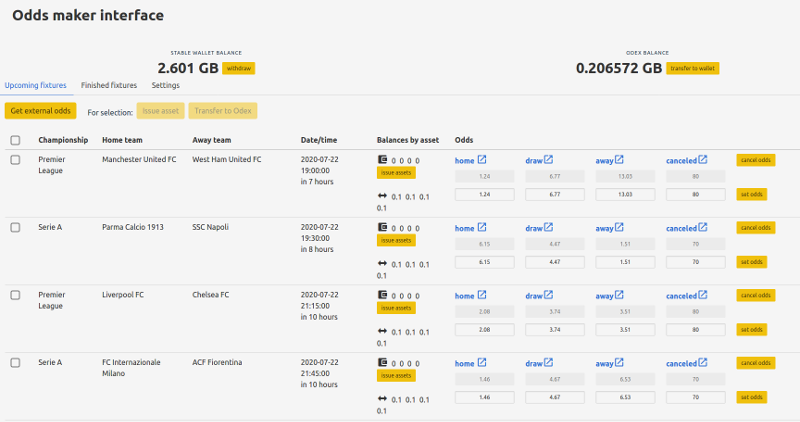

# odds-maker-interface

This is a web application made with vuejs that allows you to play the bookmaker and easily put numerous betting tokens for sale on [Odex](odex.ooo).
The application embeds a wallet and can sign Odex orders, so you always keep full control of your bytes and assets.



## Installation

### Run locally (recommended)

It's the recommended way since you run a source code that is publicly reviewable.

Install Nodejs in a version from 8 to 10.

```
git clone https://github.com/byteball/odds-maker-interface.git
``` 

```
cd odds-maker-interface
```

```
npm install
```

```
npm run serve
```

The application can be opened on your browser at address http://localhost:8080

### Run as demo

This bot is available ready to use on [odds-maker.papabyte.com](https://odds-maker.papabyte.com)


## Usage

### Set a private key

Generate a WIF private key following one of the option described there: [https://obytejs.com/utils/generate-wallet](https://obytejs.com/utils/generate-wallet) then copy it to the settings.


### Fund the web wallet

Send a transaction to the web wallet address indicated in the settings under the WIF form input. The amount should appear as stable after a few minutes.


### Issue assets

Select the upcoming matches for which you want to offer tokens and choose to issue tokens for them. You will be asked to select the amount in GBYTE you want to invest for each set of tokens and a transaction will be sent to the asset issuer AA to request them. Once the transaction is confirmed, the different assets will appear next to the wallet icon.


### Transfer assets to Odex

To be able to sell the tokens you first need to transfer them to your Odex account, this account is handled by the autonomous agent that powers Odex. It is linked to your web wallet so be sure to never lose access to this wallet otherwise there would ne no way to withdraw the funds.

Select the concerned matches and choose to transfer to Odex, that will take a few time since only one asset can be transfered by transaction. Once transactions confirmed, the Odex balances will appear below the wallet balances.


### Set odds manually

Odds can be set manually by entering them in the form, when you click on 'set odds' the corresponding order is signed and sent to Odex.

### Set odds automatically

Click on 'get external odds'. You will be proposed to set an API key from [https://the-odds-api.com/](https://the-odds-api.com/). Select the championship for which you want to obtain the odds then either get and prefill the odds form (to review/modify them before) or get and set them directly.

### Odds cancellation

At any time you can cancel an order, for safety all order are set to expire at the time the match will begin. This expiration time is enforced by the Odex autonomous agent and doesn't require that this application is online. You can also set a shorter expiry time in the settings.

### Redeem winning assets

After a result for a match has been posted by the oracle, you can redeem the winning assets that weren't sold. Firstly you have to transfer them to the wallet, once in your wallet they can be redeemed for bytes. 

